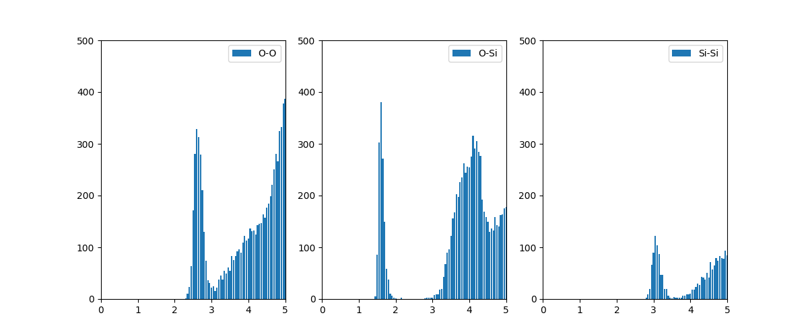
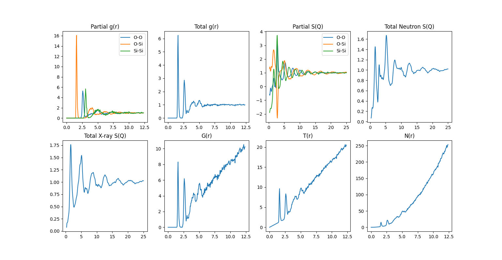

# sova-cui-dev


# Installation and Run
1. Clone the SOVA repo

  ```sh
  git clone https://github.com/***/sova-cui.git
  ```

2. Install the pip package    
  ```sh
  # Option 1: install from PyPI
  pip install sova
  
  # Option 2: install from source
  To enable verbose mode, use the -v option.
  pip install [-v] .
  ```
3. Run
  ```sh
  # Console
  > cd example
  > python example1.py
  
  # Jupyter notebook
  Please execute the files located in the 'example_jypyter' folder.
  ```    
  
## Usage

Basic usage:

```python
from sova.core.file import File

path = "./data/amorphous_md/a_SiO2_speed1e11K_rand.xyz"
f = File.open(path)
atoms = f.getatoms()
```

## Example
```sh
example1 : PDF analysis of the XYZ file with cell information.
example2 : PDF analysis of the XYZ file with cell information. sort [Si,O]
example3 : PDF analysis of the XYZ file with no cell information.
example4 : PDF analysis of the CIF file
example5 : PDF analysis of the cfg file (Reverse Monte Carlo file format)
example6 : Coordination number calculation
example7 : Angle distribution calculation (cfg file)
example8 : Angle distribution calculation (CIF file)
example9 : Polyhedra calculation (CIF file)
example10 : Polyhedra calculation XYZg file)
example11 : RINGs calculation
example12 : Cavity calculation
example13 : Data save and load.
``` 

execute example1.py

histogram 


g(r), S(Q)

